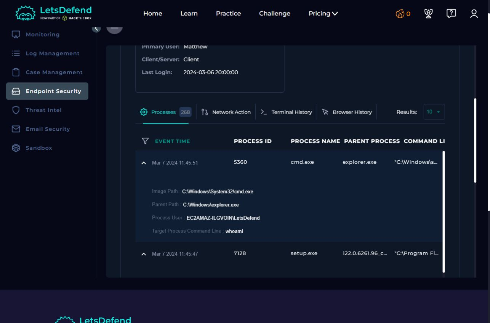
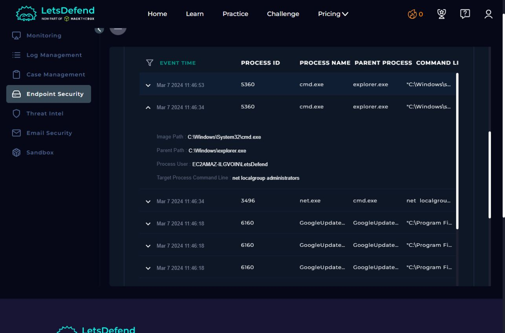

# SOC176 evidence register

**Source:** LetsDefend training environment, SOC176 / Event ID 234. **Reviewed:** September 25, 2026. **Host:** Matthew / 172.16.17.148.

This is a mentor-assisted review of Juan Soto's previously completed simulation. Juan identified the `whoami` observation and explained the group-membership query. The mentor verified fields, captured the two screenshots below and helped prepare the report. This register contains selected UI transcriptions and screenshots, not a complete raw-log export or evidence of production SOC employment.

## E1 — Search scope and authentication records

In [Log Management](https://app.letsdefend.io/logmanagement/logs), filter Source Address contains `218.92.0.56`, All Time. The reviewed pages returned 30 records: 15 Firewall and 15 OS. OS records comprise 14 failures (4625) and one success (4624). Failed account names: sysadmin (6), admin (3), guest (3), Matthew (2).

Selected fields transcribed from the interface:

| Displayed time, March 7, 2024 | EventID | Username | Source IP | Destination | Detail |
|---|---|---|---|---|---|
| 03:44:57 | 4625 | Matthew | 218.92.0.56 | 172.16.17.148:3389 | Error 0xC000006A |
| 03:44:58 | 4625 | Matthew | 218.92.0.56 | 172.16.17.148:3389 | Error 0xC000006A |
| 03:44:59 | 4624 | Matthew | 218.92.0.56 | 172.16.17.148:3389 | Logon Type 10, RemoteInteractive |

The success detail also shows source port 31245. This supports successful remote authentication following failures; it does not identify the person using the credentials. No screenshot or native XML export of these authentication records is included in this package. Access to the training platform is required to repeat the query.

## E2 — Identity query

In [Endpoint Security](https://app.letsdefend.io/endpoint), select Matthew, Processes, 10 results per page, page 2. Expand the `cmd.exe` row at 11:45:51 on March 7, 2024.

| Field | Value |
|---|---|
| Process ID of displayed row | 5360 |
| Process Name | cmd.exe |
| Image Path | `C:\Windows\System32\cmd.exe` |
| Parent Path | `C:\Windows\explorer.exe` |
| Process User | `EC2AMAZ-ILGVOIN\LetsDefend` |
| Target Process Command Line | `whoami` |

PID 5360 belongs to the displayed `cmd.exe`; it is not a separately verified PID for `whoami.exe`. No command output or session identifier was observed.

## E3 — Group-membership query

In the same Processes view, page 1, expand the **cmd.exe** row at 11:46:34, rather than the adjacent net.exe row.

| Field | Value |
|---|---|
| Process ID of displayed row | 5360 |
| Process Name | cmd.exe |
| Image Path | `C:\Windows\System32\cmd.exe` |
| Parent Path | `C:\Windows\explorer.exe` |
| Process User | `EC2AMAZ-ILGVOIN\LetsDefend` |
| Target Process Command Line | `net localgroup administrators` |

The platform associates both queries with the same cmd.exe PID, user and host, 43 seconds apart by the row timestamps. This is stronger than timestamp proximity alone. A neighboring net.exe record has PID 3496, parent cmd.exe and the same group query. The screenshot does not show a numeric parent PID for that child; none is invented here.

## Limits and interpretation

- `whoami` requests the current domain/user identity; `net localgroup administrators` requests the group's members. Neither command changes privileges. Checking whether LetsDefend belonged to Administrators is plausible, but intent and command output are not established. [Microsoft: whoami](https://learn.microsoft.com/en-us/windows-server/administration/windows-commands/whoami), [Microsoft: net localgroup](https://learn.microsoft.com/en-us/previous-versions/windows/it-pro/windows-server-2012-r2-and-2012/cc725622%28v%3Dws.11%29).
- The process user is LetsDefend; the successful authentication username is Matthew. No logon/session identifier linking these records was observed. The queries therefore remain unattributed to that RDP session.
- Log Management does not label its displayed timezone. Monitoring shows alert time `2024-03-07T11:44:00+03:00`; Endpoint shows row times around 11:45–11:46 without a timezone label. No cross-source conversion is assumed. Accessibility text also labels the expanded group-query container 11:46:53, while the visible row says 11:46:34; the row timestamp is preserved rather than explaining away this discrepancy.
- Host Information currently displays **Host Contained**. The reviewer did not change it; the actor and time of containment are not established.
- The original scenario feedback calls the incident successful brute force. Its historical reputation result is not a fresh threat-intelligence lookup. Later impact, persistence, data access and lateral movement remain unverified.

Screenshots are unedited viewport captures from the review, not captures from the original May investigation. [Return to the report](06-rdp-brute-force-account-compromise.md).
