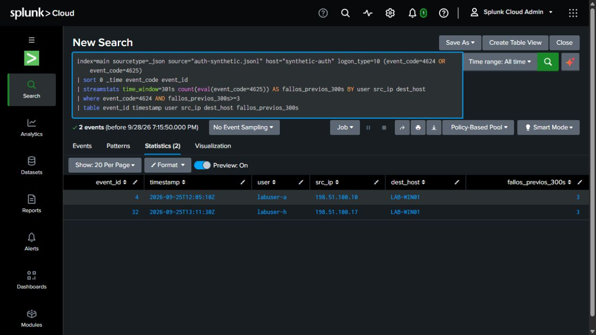
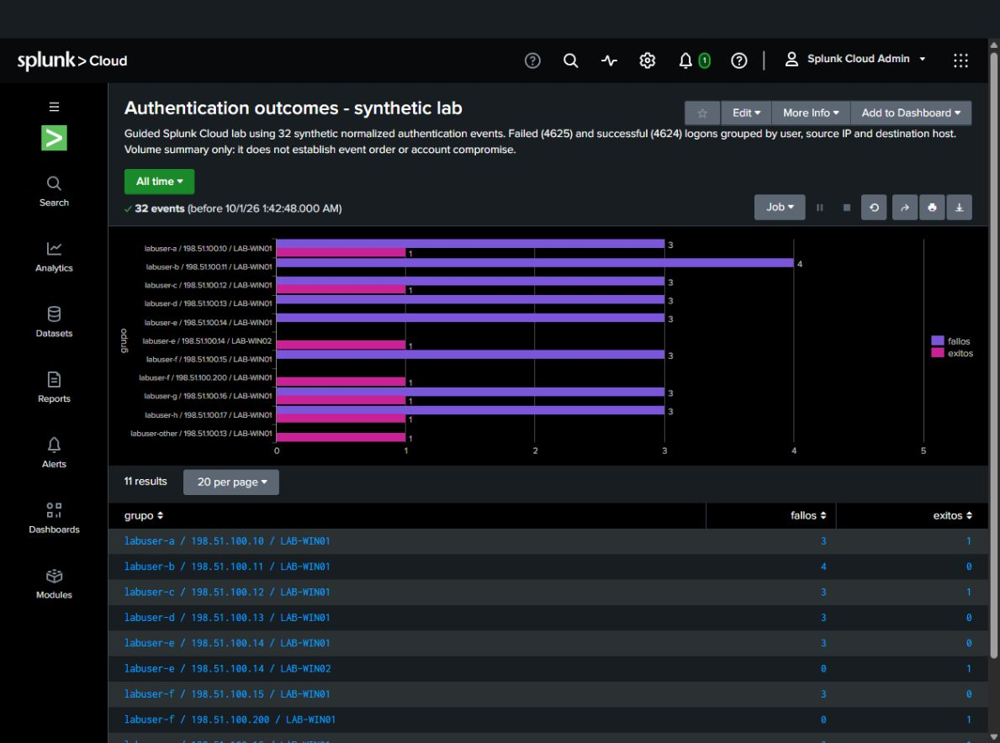
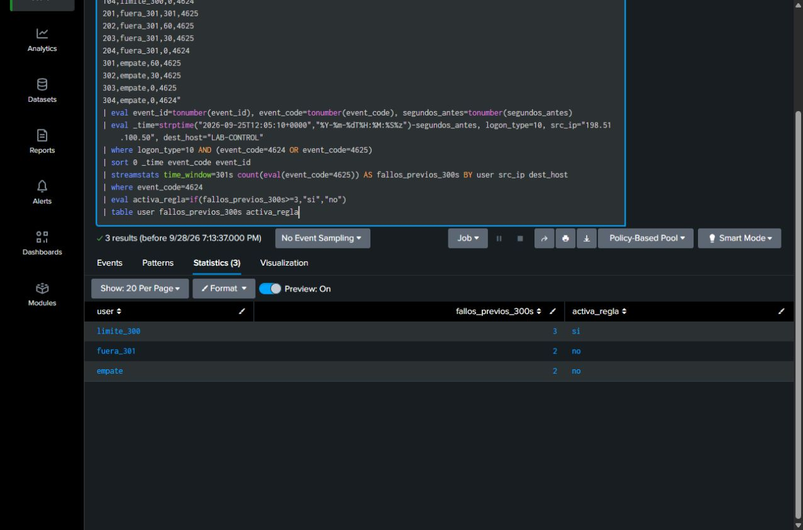

# Splunk authentication sequence detection

**Juan Soto | Guided Splunk Cloud lab | Synthetic data**

I tested an SPL query that finds successful RDP-style authentications preceded by at least three failures for the same user, source IP and destination within 300 seconds. The 32-event dataset covers eight scenarios, including events that must not be combined and an authorized sequence that still matches the rule.

**Observed result:** success IDs **4 and 32**, with three prior failures each. An additional boundary control exposed a defect in the original query. The corrected version matches all eight scenario expectations and all three boundary controls for the supplied whole-second timestamps.

This is a detection search with reproducible lab evidence. No scheduled alert, production deployment or confirmed compromise is claimed.

## My work and assistance

I uploaded the data, validated counts and UTC timestamps, ran guided searches, changed the time window, executed the boundary correction and explained grouping, results and investigation limits. I also ran the volume summary, selected its bar chart, and saved and opened the report. Codex supplied the synthetic fixture, SPL, expected tests and mentoring; it compared the outputs, executed the final detection regression and adjusted the chart's axis and value labels. Documentation and evidence capture were assisted. The final regression screenshot below is mentor-executed; my baseline and boundary runs are linked separately.

The earlier [ingestion milestone](../splunk-auth-ingestion/README.md) contains the upload and field-validation evidence. The detection and boundary searches were executed on September 28, 2026; explanation, packaging and the volume report followed on September 30.

## Detection and observed output

[Corrected SPL](12-detect-success-whole-seconds.spl) · [Native result CSV](12-corrected-detection-results-2026-09-28.csv) · [My baseline screenshot](08-detection-2026-09-28.png)

| Success ID | User | Source IP | Destination | Prior failures |
|---|---|---|---|---:|
| 4 | labuser-a | 198.51.100.10 | LAB-WIN01 | 3 |
| 32 | labuser-h | 198.51.100.17 | LAB-WIN01 | 3 |

The query filters synthetic 4624/4625 events with logon type 10, sorts chronologically, counts preceding failures by `user src_ip dest_host`, and returns qualifying successes. The result table is a starting point for investigation; surrounding events remain available in the source data.

## Authentication volume report

[Summary SPL](13-volume-summary-for-chart.spl) · [Native result CSV](13-volume-summary-results-2026-09-30.csv) · [Saved report screenshot](13-report-view-2026-09-30.png)

The saved **Authentication outcomes - synthetic lab** report summarizes all 32 synthetic events as **25 failures and 7 successes across 11 user/source/destination groups**. Both the bar chart and statistics table were verified after opening the report. The screenshot shows the full chart and the first part of the table; the CSV contains all eleven rows.

This is a descriptive volume report. It does not check event order or the 300-second window, and the groups are not alerts or confirmed attacks. For example, scenarios A and C both show three failures and one success, although only A has failures before success. That distinction is checked by the separate detection query above.

The native CSV was exported from completed job `1790818968.15226`. Opening the saved report reused that job; it was not a new independent execution. The report was saved with a time-range picker and with both chart and statistics table. No scheduled alert or dashboard was created.

## Scenario checks

| Scenario | Expected match | Observed success ID |
|---|---|---|
| A: three failures then success, same correlation fields | Yes | 4 |
| B: failures only | No | None |
| C: success before failures | No | None |
| D: success for another account | No | None |
| E: success on another destination | No | None |
| F: success from another source IP | No | None |
| G: success outside the window | No | None |
| H: matching pattern with authorized-retry context | Yes | 32 |

The [expected-results file](expected-results.json) preserves the original expectations; its null actual-result fields are not an execution record. Actual results are in the native CSVs and screenshots. Eight matching fixture expectations do not measure production accuracy.

## Boundary defect and correction

The contract includes failures exactly 300 seconds before success and excludes failures at 301 seconds or tied with the success timestamp. My run of [the original boundary query](10-time-boundary-controls.spl) returned 2/no for all three controls. The exactly-300-second case should have returned 3/si.

The mentor identified the mismatch in the supplied query. I ran [the corrected controls](11-time-boundary-whole-seconds-candidate.spl), changing `time_window=300s` to `301s` for this whole-second fixture:

| Control | Expected | Initial actual | Corrected actual |
|---|---|---|---|
| Exactly 300 seconds | 3 / si | 2 / no | 3 / si |
| 301 seconds | 2 / no | 2 / no | 2 / no |
| Failure tied with success | 2 / no | 2 / no | 2 / no |

[Initial screenshot](10-boundary-initial-2026-09-28.png) · [Initial native CSV](10-boundary-initial-results-2026-09-28.csv) · [Corrected native CSV](11-boundary-corrected-results-2026-09-28.csv)

For integer-second event ages, less than 301 seconds implements the intended inclusive 300-second boundary in these observed controls. **This correction does not support fractional timestamps:** an age of 300.5 seconds would be outside the contract but could enter a 301-second window. Tied timestamps are ordered with successes before failures to exclude simultaneous failures.

The [original detection](08-detect-success-after-failures.spl) and failed control are retained. The mentor reran the corrected detection on the original 32 events; IDs 4 and 32 remained the only matches. The [60-second variant](09-detect-success-after-failures-60s.spl), which I ran with the threshold still at three, returned no matches. My initial prediction of two was corrected with guidance before that run.

## Why a match is not proof of compromise

In scenario H, events 29–32 show three failures followed by success for `labuser-h`, from `198.51.100.17` to `LAB-WIN01`, between 13:10:00 and 13:11:30 UTC. The rule correctly matches ID 32.

The fictional investigation context says the account owner confirmed authorized retries. That supports a benign disposition within the exercise. The confirmation is supplied context, not information extracted from the logs. In a real investigation I would correlate the source, destination, timing and surrounding account/session activity before deciding the outcome. No real owner contact, endpoint investigation or containment was performed here.

## Reproduce the lab

1. Upload [auth-synthetic.jsonl](auth-synthetic.jsonl) once to an authorized Splunk training environment. The recorded setup used index `main`, sourcetype `_json`, source `auth-synthetic.jsonl` and host `synthetic-auth`. If your metadata differs, update the query filters consistently. Reuse an existing correct upload to avoid duplicates.
2. Select **All time** and **No Event Sampling**. The events are dated September 25, 2026. Run [query 01](01-ingestion-count.spl): expect 32 events and 32 distinct IDs.
3. Run [query 03](03-validate-timestamps.spl): expect 32 total events, 32 parsed dates and 32 correct timestamps. Resolve any mismatch before testing detection logic.
4. Run [query 12](12-detect-success-whole-seconds.spl): expect IDs 4 and 32, each with three failures. Compare them with the scenario table.
5. Run [query 11](11-time-boundary-whole-seconds-candidate.spl): expect 3/si, 2/no and 2/no for the three controls above. Its `makeresults` data is temporary; no second upload is required.
6. Run [query 13](13-volume-summary-for-chart.spl) with the same All time range: expect 11 rows, with `fallos` totaling 25 and `exitos` totaling 7. Select **Visualization > Bar**. The recorded formatting used a non-stacked linear chart, axis minimum 0, interval 1 and data values on. Save as a report with **Bar Chart and Statistics Table** and a time-range picker, then open it to check both views.

Observed environment: Splunk Cloud 10.5.2605.9. These instructions document the original executions; another fresh environment has not been tested. CSVs, screenshots, SPL and fixture files in this package preserve the originals; [SHA256SUMS.txt](SHA256SUMS.txt) records their hashes.

## Limits and next engineering steps

- Synthetic normalized JSON does not validate native Windows collection or field extraction.
- The three-failure threshold is an exercise parameter. Attempts split across accounts, sources or destinations fall outside this rule's scope.
- Production use would require fractional-time handling, event deduplication, lookback for scheduled runs, late-arrival handling, repeat-alert suppression and performance checks. No scheduled alert was configured.
- The table contains qualifying successes, not a full investigative timeline. A match requires follow-up and does not establish compromise.

Reference: [Splunk streamstats documentation](https://help.splunk.com/en/splunk-cloud-platform/search/search-reference/9.2.2406/search-commands/streamstats). The exact boundary finding is based on the saved controls, not an assumed documentation guarantee.
