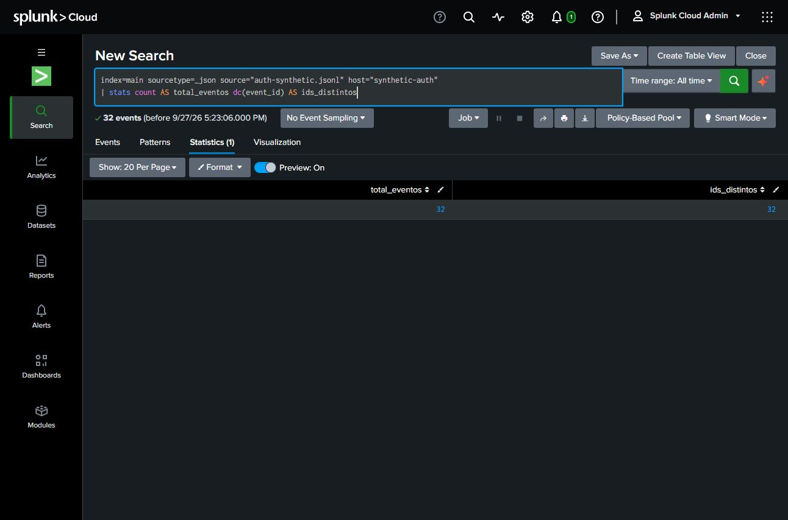
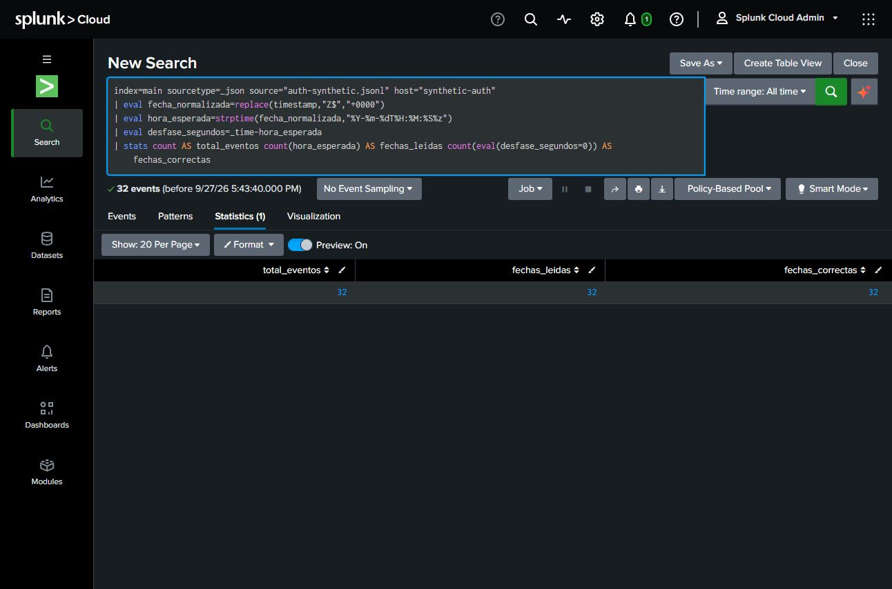

# Splunk Cloud: validating authentication data before detection

**Juan Soto · Guided lab · First milestone · September 2026**

I imported a small synthetic authentication dataset into Splunk Cloud and ran checks on event counts, unique IDs and timestamps. I then filtered failed and successful sign-ins for one account. This milestone documents the ingestion work completed on September 27; the broader detection project is still in progress.

## Verified results

| Check | Observed result | Evidence |
|---|---|---|
| Ingested events and distinct event IDs | 32 events / 32 distinct IDs | [Query 01](01-ingestion-count.spl), [screenshot](01-ingestion-count-2026-09-27.png) |
| Event time compared with the input UTC timestamp | 32 parsed timestamps / 32 equal to `_time` | [Query 03](03-validate-timestamps.spl), [screenshot](03-timestamp-validation-2026-09-27.png) |
| Failed sign-ins for `labuser-a` | 3 events, IDs 1–3 | [Query 04](04-filter-failed-account-guided.spl), [observation](04-failed-account-filter-observation.json) |
| Successful sign-ins for the same account | 1 event, ID 4 | [Query 05](05-filter-success-account-assisted.spl), [observation](05-success-account-filter-observation.json) |

The screenshots show actual Splunk searches. The observation JSON files are mentor transcriptions of results seen in the completed search jobs, **not native Splunk exports**. Only local file references were adjusted for this public folder. They retain their original observation date and describe what had and had not been verified at that point.

## My contribution and assistance

I performed the upload and ran the searches with step-by-step guidance. For the account filter, I proposed changing event code `4625` to `4624` and predicted one result; the search returned event ID 4. I received help placing the filter correctly in SPL.

Codex supplied the synthetic fixture, initial queries and explanations, and helped verify and document the results. This is evidence of guided execution, not independent authorship of a detection or professional SOC experience.

## Reproduce this milestone

1. Use an authorized Splunk environment and download [auth-synthetic.jsonl](auth-synthetic.jsonl). It contains 32 synthetic, normalized JSON events. It is not a native Windows event export or a capture from a compromised host.
2. Upload it once with `sourcetype=_json`, source `auth-synthetic.jsonl`, host `synthetic-auth` and a suitable test index. The original lab used `index=main`; change that part of every query if using another index.
3. In data preview, confirm one JSON line per event and that `timestamp` is interpreted as event time. Choose **All time** when searching: the fixture uses September 25, 2026 timestamps. Keep event sampling disabled.
4. Run the five numbered `.spl` files in this folder. Query 01 checks event count and unique IDs. Query 02 lists events chronologically. Query 03 compares `_time` numerically to the explicitly parsed UTC input. Queries 04–05 select one account and event code.
5. Compare your observed results with the table. A different count or timestamp result is something to investigate, not to edit away. Repeated uploads can create duplicate events. Use a fresh test index or scope before retrying; do not assume `dc(event_id)` alone proves ingestion occurred exactly once.

The observed environment reported Splunk Cloud version `10.5.2605.9`. A different version or ingestion configuration may require adjustment. The SPL is kept as executed, including Spanish output aliases.

## Why these checks matter

Before drawing conclusions from a sequence of sign-ins, I need to know that the intended data arrived and that the event times are interpreted correctly. An event count alone does not validate every field or prove that an account was compromised.

This small milestone does **not** demonstrate production-scale ingestion, a deployed alert, a local home lab, or malicious activity. The dataset generates no network connections or authentication attempts. Subsequent work covers temporal correlation, negative scenarios and investigation context; those results are outside this release.
